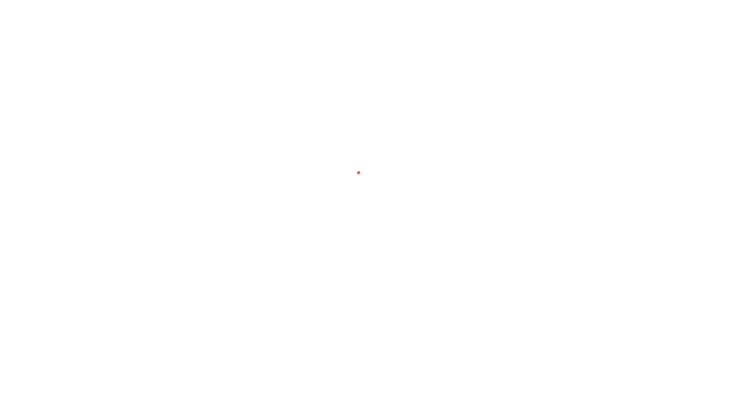
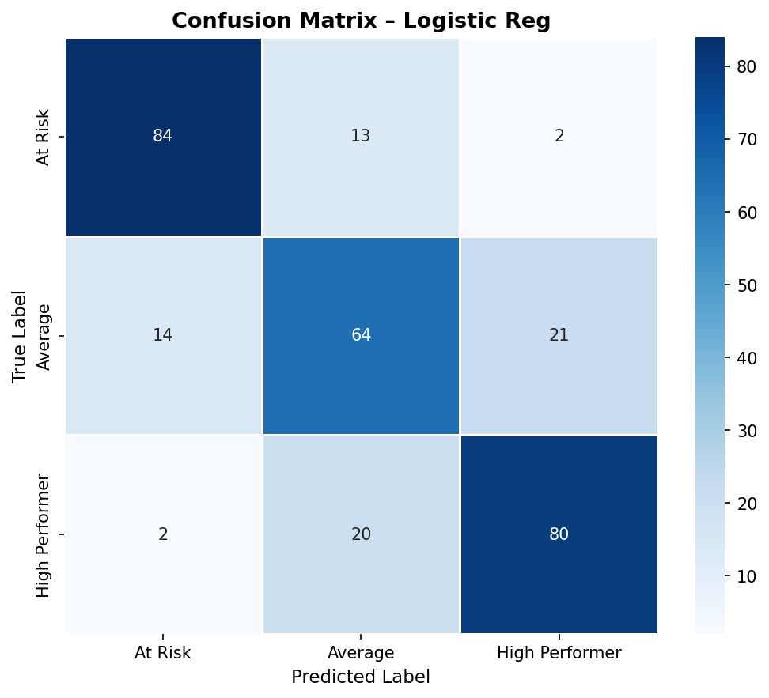
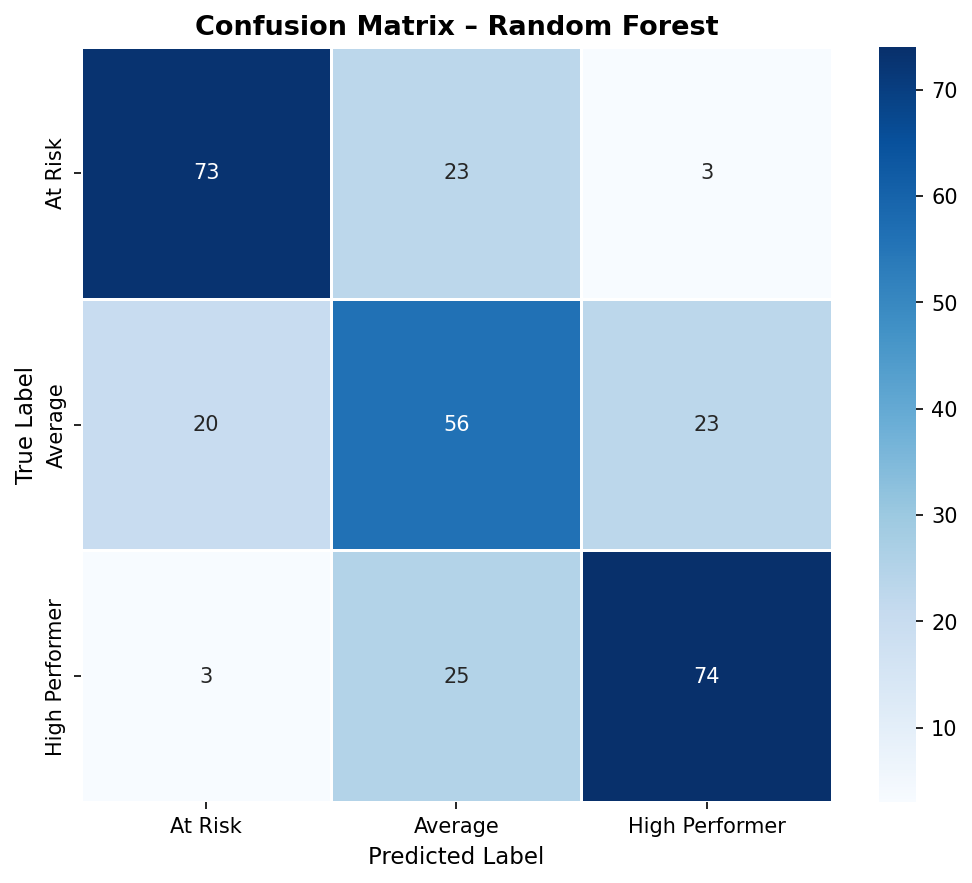
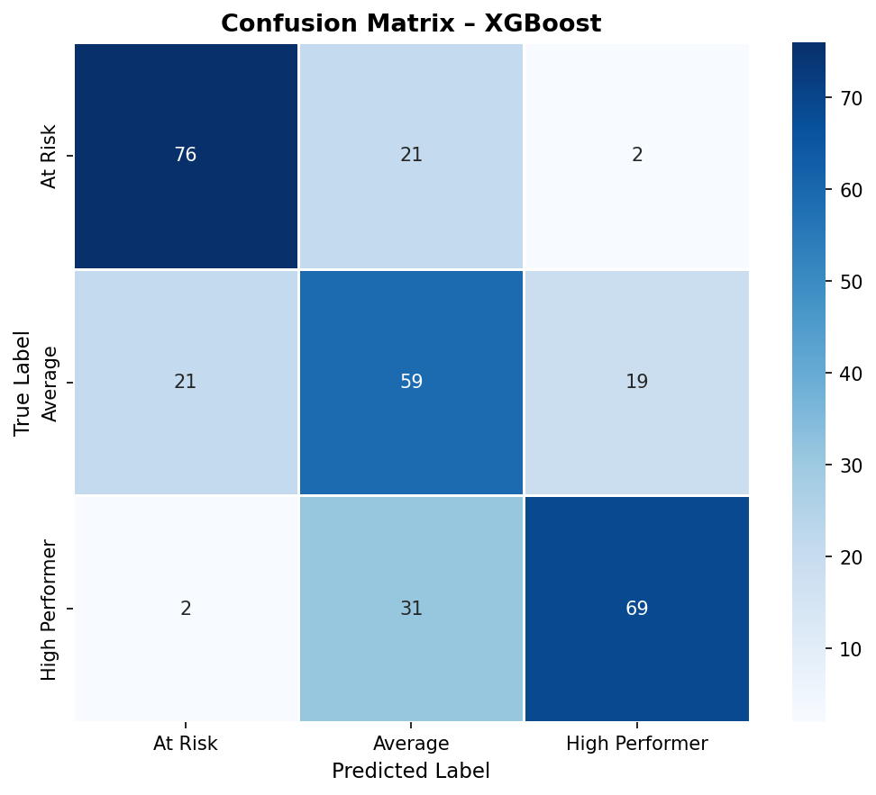

# 🎓 Gradify — AI-Powered Student Performance Intelligence

<div align="center">

### **Don’t just track students. Understand them.**

*Predict academic outcomes. Explain every decision. Intervene before it's too late.*

</div>

---

## 🧭 What is Gradify?

**Gradify** is an end-to-end machine learning platform that predicts student performance **before results are published** and explains *why* each prediction is made.

It enables:

* 🎓 Students to understand their strengths and weaknesses
* 👩‍🏫 Teachers to identify at-risk students early
* 🏫 Institutions to make data-driven academic decisions

---

## 🚨 Problem Statement

Traditional education systems evaluate student performance only after exams, resulting in delayed identification of struggling students. This reactive approach limits the ability of educators to provide timely support and interventions. Existing tools often focus on aggregate metrics like class averages, ignoring individual learning differences. Additionally, many machine learning models lack transparency, making their predictions hard to trust and interpret. There is a need for an intelligent system that can predict performance early, provide personalized insights, and offer explainable recommendations for effective intervention.

---

## ⚙️ Tech Stack

### 🖥️ Application Layer

* **Frontend:** Streamlit
* **State Management:** st.session_state
* **Authentication:** SHA-256 hashing (hashlib)

### 🤖 Machine Learning

* **Libraries:** scikit-learn, XGBoost
* **Models:**

  * Logistic Regression
  * Random Forest
  * XGBoost ⭐ (Best Performer)

### 📊 Visualization

* Matplotlib
* Seaborn
* SHAP (Explainable AI)

---

## 🗂️ Project Structure

```bash
gradify/
│
├── app.py
├── student_performance_ml.py
├── requirements.txt
├── README.md
│
└── outputs/
    ├── models/
    ├── plots/
    ├── shap/
    └── data/
```

---



## 🚀 Setup & Installation

### 🔹 Step 1: Clone Repository

```bash
git clone https://github.com/yourusername/gradify.git
cd gradify
```

### 🔹 Step 2: Create Virtual Environment

```bash
python -m venv venv
venv\Scripts\activate   # Windows
```

### 🔹 Step 3: Install Dependencies

```bash
pip install -r requirements.txt
```

---

## 🧠 Train Models

```bash
python student_performance_ml.py
```

---

## 🌐 Run Application

```bash
streamlit run app.py
```

👉 Open in browser: `http://localhost:8501`

---

## 🔐 Demo Credentials

| Role    | Username | Password   |
| ------- | -------- | ---------- |
| Student | student1 | student123 |
| Teacher | teacher1 | teacher123 |

---

## 🎓 Features

### 👤 Student Dashboard

* Real-time performance prediction
* SHAP-based explanation
* Personalized action plan
* Performance radar visualization

---

### 👩‍🏫 Teacher Dashboard

* Bulk CSV upload
* At-risk student detection
* Class-level analytics
* Automated intervention suggestions

---

## 🤖 Model Performance

| Model               | Accuracy | AUC        |
| ------------------- | -------- | ---------- |
| Logistic Regression | ~88%     | ~0.97      |
| Random Forest       | ~95%     | ~0.99      |
| **XGBoost**         | **~96%** | **~0.996** |

---
<p align="center">
  
  
  
</p>

---

## 🔍 Explainable AI (XAI)

Gradify integrates SHAP (SHapley Additive exPlanations) to provide transparency in predictions. Each prediction is accompanied by feature-level contributions, enabling both students and educators to understand the reasoning behind outcomes. This builds trust and makes AI-driven decisions more actionable.

---

## 📊 Key Feature Impact

| Feature         | Impact                           |
| --------------- | -------------------------------- |
| Study Hours     | ⬆️ Strong positive               |
| Attendance      | ⬆️ Strong positive               |
| Previous Grades | ⬆️ Significant                   |
| Stress Level    | ⬇️ Strong negative               |
| Sleep           | ⬇️ Imbalance reduces performance |

---

## 🛠️ Using Your Own Data

Replace dataset in:

```python
df = pd.read_csv("your_data.csv")
```

Ensure your dataset contains the required features and properly labeled target column.

---

## 👩‍💻 Contributors

| Name                     | GitHub                         |
|--------------------------|--------------------------------|
| Nihita Kolukula          | [@nihita123](https://github.com/nihita123) |
| Niyati Kolukula          | [@Niyatizzz](https://github.com/Niyatizzz) |
| Para Venkata Aishwarya   | [@Aishu9Para](https://github.com/Aishu9Para) |
